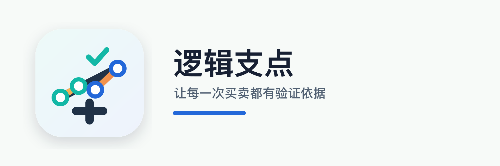

<p align="center">
  
</p>

<h1 align="center">逻辑支点 · Logical Leverage</h1>

<p align="center">
  <strong>An investment decision journal built on "pivots" — record the reasoning behind every trade, replay the context, review the outcome.</strong>
</p>

<p align="center">
  <em>「基于支点，保持理性」— log why you bought, so your future self can judge whether you were right for the right reasons.</em>
</p>

<p align="center">
  
  
  
</p>

<p align="center">
  <em>Source is private (deployed to production). This repo is a showcase of the product and its engineering.</em>
</p>

---

## The problem

Most people buy and sell on impulse, then forget why. When a position goes wrong, they can't tell whether the thesis was flawed or the execution was — so they never actually improve. **Logical Leverage forces you to write down the logic before you act, and holds you to it.**

## The core idea — thesis → pivots → review

Every position starts as an **investment thesis** (标的 + 状态 + 仓位配置). Under it you record **pivots** (支点) — the concrete conditions that justify buying, adding, or selling. As reality plays out you check each pivot off; when enough buy-pivots trigger, the system nudges you to act. When the position closes, you write a **review** and confront what you got right and wrong.

```
InvestmentThesis            一条投资逻辑（标的 + 状态 + 仓位）
  ├── Pivot[]               买入 / 加仓 / 卖出 / 持有 的支点
  │     └── PivotCheckLog[] 每次手动验证的记录
  ├── ActionRecord[]        系统生成的行动提醒（如"可买入"）
  ├── PositionLog[]         建仓 / 减仓 / 清仓历史
  └── Review                结束后的复盘
```

Thesis lifecycle: `watching` → `ready_to_buy` → `holding` → `reducing` → `ended` → **Review**.

## Features

- 📌 **Pivot-based decision logging** — separate buy / add / sell / hold rationale, each independently verifiable
- 🔔 **Action reminders** — when triggered buy-pivots cross a threshold, the app surfaces a "ready to buy" prompt
- 📊 **Position tracking** — full history of entries, reductions, and exits per thesis
- 🪞 **Structured review** — every closed position ends in a written post-mortem
- 💼 **Portfolio holdings** — track a permanent portfolio independently of the thesis system
- 🛠 **Admin dashboard** — manage users, content, and data from a web back office

## Architecture

A full self-hosted stack, built and operated end to end by one person:

| Layer | Tech | Notes |
|---|---|---|
| **Client** | Taro 4.x · React | WeChat Mini Program |
| **Admin** | React · Vite · Ant Design 5 | Web back office |
| **Backend** | Bun · Hono · SQLite | REST + admin JSON API |
| **Deploy** | Ubuntu · nginx · certbot · systemd | One-click deploy script, HTTPS, service unit |

Shared, non-sensitive config lives in a single source of truth and is synced into each sub-project by script — the client, admin, and backend can each be split into their own repo but are kept as a monorepo for one-command operation.

## 📸 Screenshots

> _Coming soon — mini-program screens of the thesis list, pivot detail, action reminder, and review flow._

---

<p align="center">
  <sub>Built by <a href="https://github.com/agnostic-ap">Aldrin (agnostic-ap)</a> · <a href="https://gt2kk.cn">gt2kk.cn</a> · Source private, available for walkthrough on request.</sub>
</p>
